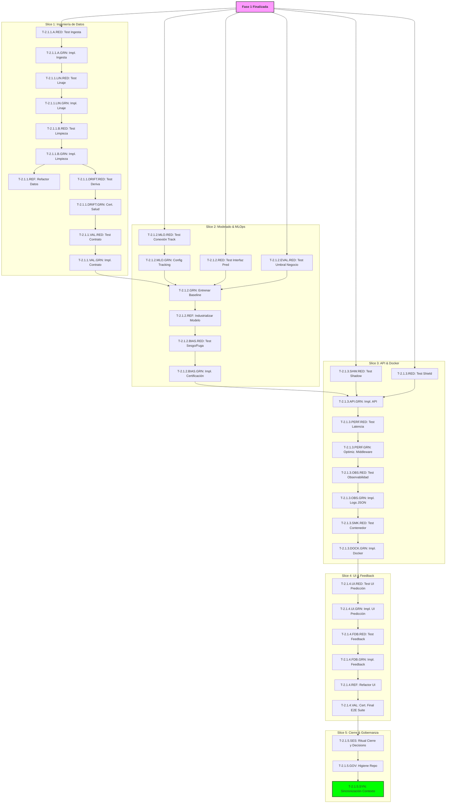

# Proyecto Flores_ML - Backlog Maestro

Este documento orquesta la ejecución del proyecto bajo las metodologías **SpecDD**, **BDD** y **TDD**. Sigue una estructura de **Slices Verticales** para garantizar la validación continua.

---

## ⚙️ Protocolo de Gestión de Iteraciones
Toda iteración en este proyecto sigue un ciclo de vida estricto gobernado por el `ai-backlog-manager`:

1.  **Estados de Iteración:** `No iniciada` -> `En progreso` -> `Finalizada` | `Bloqueada`.
2.  **Cierre de Iteración:** Solo se marca como `Finalizada` cuando:
    *   Todas las tareas internas están en estado `Completada`.
    *   **Validación Humana:** El humano ha realizado pruebas de usuario final y confirma que la iteración es funcional.
3.  **Gestión de Bloqueos:** Si el humano detecta fallos durante sus pruebas, la iteración se marca como `Bloqueada`.
4.  **Recuperación:** Al bloquearse una iteración, se deben añadir tareas de tipo `Revision / Fallo Test`. No se permite iniciar la siguiente iteración hasta que estos fallos sean resueltos y la iteración actual sea `Finalizada`.

---

## Fase 1: Descubrimiento y Entendimiento del Negocio
**Objetivo:** Transformar la necesidad de negocio en una especificación técnica ejecutable y validar la factibilidad de los datos.

### Iteración 1.0: Fundamentos y Entendimiento Compartido
**Estado:** Finalizada
**Objetivo:** Transformar la necesidad de negocio en una especificación técnica ejecutable y validar la factibilidad de los datos.
**Criterio de Éxito de Usuario Final (UAT):** El usuario (stakeholder) dispone de un Mockup visual navegable y una hoja de ruta técnica clara (SpecDD/SAD) que garantiza que el proyecto es viable y que el equipo entiende perfectamente los objetivos de negocio.
**Fuera de Alcance de la Iteración:** No se incluye código funcional de la aplicación, no hay conexión real a bases de datos, ni modelos de IA entrenados. Solo se entregan definiciones y prototipos visuales.
| **T-1.1**  | Registro de Entendimiento Compartido (Ask-Me) | @ai-business-strategist | Completada   | N/A        | `docs/Phase_discovery/shared_understanding.md` validado.                    |
| **T-1.2**  | Configuración del Proyecto (Config)           | @config-manager         | Completada   | N/A        | `docs/references/config.md` generado.                                       |
| **T-1.3**  | Documento de Requerimientos de Negocio (BRD)  | @ai-business-strategist | Completada   | N/A        | `docs/governance/BRD.md` aprobado con KPIs.                                 |
| **T-1.4**  | Contrato de Comportamiento (BDD)              | @ai-business-strategist | Completada   | N/A        | `docs/governance/behavior.md` con escenarios Gherkin.                       |
| **T-1.5**  | Reporte de Factibilidad de Datos              | @ai-data-auditor        | Completada   | N/A        | `docs/Phase_discovery/feasibility.md` con diagnóstico y plan de mitigación. |
| **T-1.6**  | Diseño de Mockup Visual (Prototipo)           | @ai-ux-designer         | Completada   | N/A        | `mockup/index.html` con diseño estático finalizado.                         |
| **T-1.7**  | Ciclo de Aprobación UAT de Interfaz           | @ai-ux-designer         | Completada   | N/A        | `docs/Phase_discovery/mockup.md` vinculante aprobado por Stakeholder.       |
| **T-1.8**  | Documento de Arquitectura de Software (SAD)   | @ai-solutions-architect | Completada   | N/A        | `docs/governance/SAD.md` con topología y stack (C4 Model).                  |
| **T-1.9**  | Especificación de Interfaces (SpecDD)         | @ai-solutions-architect | Completada   | N/A        | `docs/governance/SpecDD.md` con firmas de módulos .py.                      |
| **T-1.10** | Contrato de Datos (Esquema de Datos)          | @ai-solutions-architect | Completada   | N/A        | `docs/governance/contract.md` con Null Policy y Transformation Rules.       |
---

## Fase 2: Ingeniería y Modelado (Slices Verticales)

### Iteración 2.1: Bala Trazadora (Tracer Bullet)
**Estado:** En progreso
**Objetivo:** Ejecutar un flujo E2E transversal para una sola variable crítica para validar la arquitectura profunda, el linaje, la portabilidad y la lógica de "Shielding".
**Criterio de Éxito de Usuario Final (UAT):** El usuario accede a una pantalla de consulta con campos sencillos para ingresar las medidas de una flor. Al solicitar el análisis, el sistema identifica automáticamente el tipo de flor de forma inmediata. Para garantizar la confianza del usuario, el sistema cuenta con un "filtro de integridad" que detecta datos extraños y evita entregar resultados erróneos o dudosos. Finalmente, el usuario puede confirmar si la respuesta fue útil, permitiendo que la herramienta aprenda de su experiencia diaria.
**Fuera de Alcance de la Iteración:** No se incluye control de acceso (login/password), no se guarda un historial persistente de consultas por usuario, no hay gráficas de rendimiento del modelo en tiempo real, ni soporte para múltiples tipos de flores fuera del dataset inicial.

| ID                    | Tarea                                 | Responsable            | Estado       | Dependencias      | DoD (BDD Target / Contract)                                                                     |
| :-------------------- | :------------------------------------ | :--------------------- | :----------- | :---------------- | :---------------------------------------------------------------------------------------------- |
| **T-2.1.1.A.RED**     | Test de Ingesta Técnica (Bronze)      | @ai-data-qa-engineer   | 🟢 Completada | Phase 1           | Test fallando para lectura de `Iris.csv` y validación de tipos base.                            |
| **T-2.1.1.A.GRN**     | Implementación de Ingesta (Bronze)    | @ai-data-engineer      | 🟢 Completada | T-2.1.1.A.RED     | Carga exitosa de archivo en zona Bronze (Test Ingesta es GREEN).                                |
| **T-2.1.1.LIN.RED**   | Test de Registro de Linaje            | @ai-data-qa-engineer   | 🟢 Completada | T-2.1.1.A.GRN     | Test fallando al verificar metadatos de origen (hash, timestamp).                               |
| **T-2.1.1.LIN.GRN**   | Implementación de Gobernanza (Linaje) | @ai-data-engineer      | 🟢 Completada | T-2.1.1.LIN.RED   | Registro de linaje activo en metadatos (Test Linaje es GREEN).                                  |
| **T-2.1.1.B.RED**     | Suite de Tests de Integridad (Silver) | @ai-data-qa-engineer   | 🟢 Completada | T-2.1.1.LIN.GRN   | Escenarios `Rechazo de valores fuera de rango` y `Rechazo por nulos` son RED.                   |
| **T-2.1.1.B.GRN**     | Implementación de Limpieza Silver     | @ai-analytics-engineer | 🟢 Completada | T-2.1.1.B.RED     | Escenarios `Rechazo de valores fuera de rango` y `Rechazo por nulos` son GREEN.                 |
| **T-2.1.1.REF**       | Refactor y Tipado de Limpieza         | @ai-analytics-engineer | 🟢 Completada | T-2.1.1.B.GRN     | `mypy` y `ruff` pasan sin errores en `src/data/`.                                               |
| **T-2.1.1.DRIFT.RED** | Test de Deriva Distribucional         | @ai-data-qa-engineer   | 🟢 Completada | T-2.1.1.B.GRN     | Test automatizado falla si detecta cambios estadísticos significativos frente a baseline (RED). |
| **T-2.1.1.DRIFT.GRN** | Certificación de Salud Estadística    | @ai-analytics-engineer | 🟢 Completada | T-2.1.1.DRIFT.RED | Ajustes de limpieza superan el test de deriva (GREEN). Reporte técnico autogenerado.            |
| **T-2.1.1.VAL.RED**   | Test de Contrato de Datos             | @ai-data-qa-engineer   | 🟢 Completada | T-2.1.1.DRIFT.GRN | Script de validación (Pydantic/Great Expectations) falla contra `contract.md`.                  |
| **T-2.1.1.VAL.GRN**   | Integración de Validador de Contrato  | @ai-data-qa-engineer   | 🟢 Completada | T-2.1.1.VAL.RED   | Validación de salida exitosa en pipeline (Test Contrato es GREEN).                              |

#### [Slice 2: Modelado & MLOps - La Inteligencia Trazable]
| ID                   | Tarea                                   | Responsable            | Estado        | Dependencias                                                    | DoD (BDD Target / SpecDD)                                                               |
| :------------------- | :-------------------------------------- | :--------------------- | :------------ | :-------------------------------------------------------------- | :-------------------------------------------------------------------------------------- |
| **T-2.1.2.MLO.RED**  | Test de Conexión a Servidor Tracking    | @ai-full-stack-sdet    | 🟢 Completada  | T-1.8 (SAD)                                                     | Script falla al intentar registrar un experimento dummy (RED).                          |
| **T-2.1.2.MLO.GRN**  | Configuración de Tracking & Registro    | @ai-mlops-specialist   | 🟢 Completada  | T-2.1.2.MLO.RED                                                 | Servidor activo (MLflow/W&B), test de conexión es GREEN.                                |
| **T-2.1.2.RED**      | Test de Interfaz de Predicción          | @ai-model-qa-validator | 🟢 Completada | T-1.9 (SpecDD)                                                  | Test fallando para el esquema `PredictionResult` definido en SpecDD.                    |
| **T-2.1.2.EVAL.RED** | Test de Umbral de Aceptación de Negocio | @ai-model-qa-validator | 🟢 Completada | T-1.3 (BRD)                                                     | Test automatizado falla si las métricas (ej. Accuracy) < Umbral BRD.                    |
| **T-2.1.2.GRN**      | Entrenamiento de Baseline con Tracking  | @ai-data-scientist     | 🟢 Completada | T-2.1.2.RED, T-2.1.2.EVAL.RED, T-2.1.1.VAL.GRN, T-2.1.2.MLO.GRN | Modelo entrenado pasa tests BDD de métricas (GREEN). Registrado en MLflow/W&B.          |
| **T-2.1.2.REF**      | Industrialización del Modelo (Módulo)   | @ai-ml-engineer        | 🟢 Completada | T-2.1.2.GRN                                                     | Código migrado de notebook a `src/models/` bajo estándares PEP8.                        |
| **T-2.1.2.BIAS.RED** | Test de Sesgo y Target Leakage          | @ai-model-qa-validator | 🟢 Completada | T-2.1.2.REF                                                     | Script de validación falla si detecta fuga de variables o sesgo estadístico (RED).      |
| **T-2.1.2.BIAS.GRN** | Mitigación y Certificación QA           | @ai-model-qa-validator | 🟢 Completada | T-2.1.2.BIAS.RED                                                | Ajustes al modelo/features superan el test (GREEN). Reporte de validación autogenerado. |

#### [Slice 3: API, Docker & Shielding - El Corazón Operativo]
| ID                   | Tarea                                  | Responsable               | Estado        | Dependencias                      | DoD (BDD Target)                                                                         |
| :------------------- | :------------------------------------- | :------------------------ | :------------ | :-------------------------------- | :--------------------------------------------------------------------------------------- |
| **T-2.1.3.SHW.RED**  | Test de Seguridad Shadow Mode          | @ai-full-stack-sdet       | 🔴 No iniciada | T-1.4 (BDD)                       | Escenario `Operación en Shadow Mode` es RED (fuga de predicción).                        |
| **T-2.1.3.RED**      | Test E2E de Lógica "Shield"            | @ai-full-stack-sdet       | 🔴 No iniciada | T-1.4 (BDD)                       | Escenario `Prevención de Falso Positivo en Virginica` es RED.                            |
| **T-2.1.3.API.GRN**  | Implementación de API Tracer (FastAPI) | @ai-backend-engineer      | 🔴 No iniciada | T-2.1.3.RED, T-2.1.2.BIAS.GRN     | Escenarios de Shield y Shadow Mode son GREEN.                                            |
| **T-2.1.3.PERF.RED** | Test de Latencia API (< 3s)            | @ai-full-stack-sdet       | 🔴 No iniciada | T-1.8 (SAD)                       | Test de carga falla si la latencia p95 > 3s (RED).                                       |
| **T-2.1.3.PERF.GRN** | Optimización de Middleware             | @ai-backend-engineer      | 🔴 No iniciada | T-2.1.3.API.GRN, T-2.1.3.PERF.RED | Refactorización de código logra que el test de latencia pase (GREEN).                    |
| **T-2.1.3.OBS.RED**  | Test de Observabilidad                 | @ai-full-stack-sdet       | 🔴 No iniciada | T-1.8 (SAD)                       | Script falla al buscar el formato JSON estructurado en la salida stdout de la API (RED). |
| **T-2.1.3.OBS.GRN**  | Implementación de Logs Estructurados   | @ai-backend-engineer      | 🔴 No iniciada | T-2.1.3.PERF.GRN, T-2.1.3.OBS.RED | Salida JSON válida detectada en logs de la API (GREEN).                                  |
| **T-2.1.3.SMK.RED**  | Smoke Test de Contenedor               | @ai-full-stack-sdet       | 🔴 No iniciada | T-2.1.3.OBS.GRN                   | Test HTTP a `localhost:8000/health` falla (RED).                                         |
| **T-2.1.3.DOCK.GRN** | Dockerización Tracer Bullet            | @ai-mlops-cloud-architect | 🔴 No iniciada | T-2.1.3.SMK.RED                   | Imagen Docker construida y en ejecución. Test Smoke pasa (GREEN).                        |

#### [Slice 4: UI & Feedback - La Experiencia de Usuario]
| ID                  | Tarea                           | Responsable           | Estado        | Dependencias     | DoD (BDD Target)                                                                    |
| :------------------ | :------------------------------ | :-------------------- | :------------ | :--------------- | :---------------------------------------------------------------------------------- |
| **T-2.1.4.UI.RED**  | Test E2E Interfaz de Predicción | @ai-full-stack-sdet   | 🔴 No iniciada | T-2.1.3.DOCK.GRN | Escenario `Usuario ingresa variables y ve predicción` (Selenium/Playwright) es RED. |
| **T-2.1.4.UI.GRN**  | Implementación UI Predicción    | @ai-frontend-engineer | 🔴 No iniciada | T-2.1.4.UI.RED   | Escenario `Usuario ingresa variables y ve predicción` es GREEN.                     |
| **T-2.1.4.FDB.RED** | Test E2E de Feedback Loop       | @ai-full-stack-sdet   | 🔴 No iniciada | T-2.1.4.UI.GRN   | Escenario `Registro de corrección manual` (Selenium/Playwright) es RED.             |
| **T-2.1.4.FDB.GRN** | Implementación Feedback Loop UI | @ai-frontend-engineer | 🔴 No iniciada | T-2.1.4.FDB.RED  | Escenario `Registro de corrección manual` es GREEN.                                 |
| **T-2.1.4.REF**     | Refactor y Estilizado de UI     | @ai-frontend-engineer | 🔴 No iniciada | T-2.1.4.FDB.GRN  | UI modularizada respeta lineamientos del Mockup y pasa linting/formatting.          |
| **T-2.1.4.VAL**     | Certificación Final E2E Suite   | @ai-full-stack-sdet   | 🔴 No iniciada | T-2.1.4.REF      | Ejecución global de la suite E2E completa arroja 100% de tests aprobados (GREEN).   |

#### [Slice 5: Cierre y Gobernanza]
| ID              | Tarea                                | Responsable             | Estado        | Dependencias | DoD                                                                        |
| :-------------- | :----------------------------------- | :---------------------- | :------------ | :----------- | :------------------------------------------------------------------------- |
| **T-2.1.5.SES** | Ritual de Cierre y Log de Decisiones | @ai-session-steward     | 🔴 No iniciada | T-2.1.4.VAL  | `handoff.md` y `decisions.md` actualizados con el resumen de la iteración. |
| **T-2.1.5.GOV** | Auditoría de Higiene del Repo        | @ai-repository-governor | 🔴 No iniciada | T-2.1.5.SES  | `.gitignore` validado, notebooks limpios y commits semánticos.             |
| **T-2.1.5.SYN** | Sincronización de Knowledge Base     | @ai-session-steward     | 🔴 No iniciada | T-2.1.5.GOV  | NotebookLM sincronizado con el estado final de la iteración.               |

#### [Diagrama de Ejecución - Iteración 2.1]

---

## Leyenda de Estados
- 🔴 **No iniciada:** Tarea pendiente de ejecución.
- 🟡 **En progreso:** Tarea en ejecución por el responsable.
- 🟢 **Completada:** Tarea finalizada, certificada y validada (GREEN).
- ⚪ **Bloqueada:** Tarea o Iteración detenida por dependencias o fallos reportados por el humano. 
    * *Nota: Una iteración bloqueada requiere tareas de tipo `Revision / Fallo Test`.*